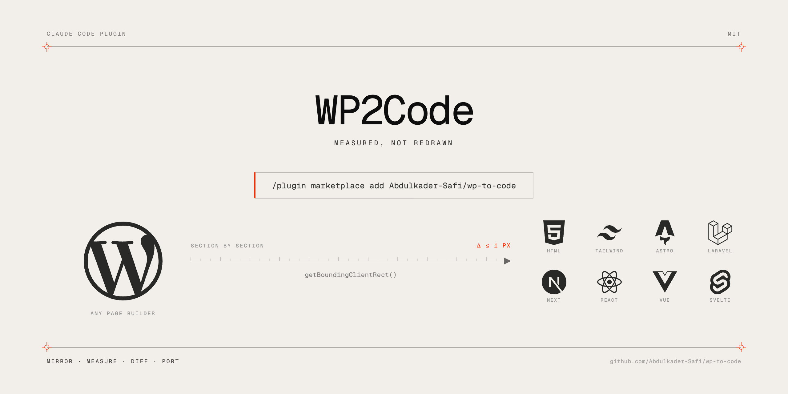

<p align="center">
  
</p>

# wp-to-code

A Claude Code plugin for porting a WordPress site to another stack by measuring the original, not by looking at it.

```
/plugin marketplace add Abdulkader-Safi/wp-to-code
/plugin install wp-to-code@wp-to-code
```

## Why

Rebuilding a design by eye gets you to about 90% and stops there, with nobody able to say what is wrong. Comparing `getBoundingClientRect()` between the original and your port gets you inside a pixel and tells you exactly which block is off and by how much.

Everything else here exists to make that comparison cheap.

## The loop

```
/wp-init https://oldsite.com     detect the builder and your stack, write the config
/wp-mirror                       download the original, serve it flat on a fixed port
/wp-theme                        design tokens from computed styles
/wp-measure home                 what the page is actually made of
/wp-port home                    write the components
/wp-diff home                    the gate
/wp-audit                        the failures that stay silent
/wp-finish                       verify everything, then delete the mirror
```

`/wp-diff` is the one that makes the rest work:

```
1440px
   #           height              top   verdict   section
   0     839 vs    838       0 vs      0   MATCH     header
   1     267 vs    267     839 vs    838   MATCH     section.stats
   2     612 vs    612    1106 vs   1206   Δtop +100 section.mission
```

It compares position as well as height, because a section can be the right height and in the wrong place. That is how a collapsed margin drags a background image 100px up the page while every height check passes.

Exit code is non-zero when anything is off, so it works as a gate in a script.

## Any source

The mirror reads HTTP responses and the measurement reads rendered DOM, so neither cares how the HTML was produced. Elementor, Divi, Bricks, Beaver Builder, WPBakery, Oxygen, Gutenberg and hand-coded themes all go through the same loop. `/wp-init` detects which one and sets the section-root selector accordingly.

Gutenberg is the easiest of them: `theme.json` is already a design token file.

Only one thing is genuinely builder-specific, and it is a single config line: the selector whose children are the page's top-level sections.

## Any target

Targets are short adapter files describing where components go and what the syntax is.

| Stack                                              | Adapter                     |
| -------------------------------------------------- | --------------------------- |
| Laravel Blade                                      | `adapters/laravel-blade.md` |
| Next.js App Router                                 | `adapters/next-app.md`      |
| Astro                                              | `adapters/astro.md`         |
| Plain HTML and CSS                                 | `adapters/plain-html.md`    |
| Nuxt, Svelte, Vue, React, Next Pages, block themes | `adapters/_generic.md`      |

Writing a real adapter is about forty lines: a six-row table, one worked component, and the notes that bit you.

## Styling modes

**`tailwind`** rebuilds the styles from measured values. Slower, and the result is a codebase.

**`passthrough`** keeps the original CSS. Fast, but read `adapters/plain-html.md` before choosing it. On Elementor and Divi the CSS is scoped per post ID, so keeping it means keeping the original wrapper markup, which means you have a static copy of a site rather than something maintainable.

## What is built

Everything in the loop above, tested end to end against a live Elementor site:

- Mirroring, including assets loaded lazily at runtime, with URL rewriting in all four encodings. Only paths actually downloaded get rewritten, so images stay remote and nothing quietly keeps pointing at the live site.
- A browser layer that kills animations, scrolls the page to lay out lazy sections, waits for fonts and images on a budget, and reports `clientWidth` so incomparable measurements are caught rather than trusted.
- Geometry diffing on height and position, at every configured viewport.
- Token census from computed styles, with real breakpoints separated from plugin defaults.
- Static audit for undefined tokens, interpolated class names, `leading-normal` on large text, padding on fixed-width boxes, and arbitrary values duplicating a token.
- A gotchas skill the model reads before writing markup.

## What is not built

Named so you know what you are choosing when you reach for it:

- **Style diffing.** Geometry only. Matching nodes across two different DOM structures is the real work here, and an unverified heuristic is worse than no check. This is the biggest gap: two of the worst bugs in the project this came from were style bugs that geometry catches only by luck.
- **Component clustering.** `/wp-port` tells you to look for reuse; nothing finds it for you.
- **Font conversion.** No ttf to woff2 step. Fonts are mirrored as they are.
- **Content from the REST API.** `/wp-init` detects whether `/wp-json` is available and records it, but extraction still reads the DOM.
- **Interactive behaviour.** `/wp-measure --mode interactive` inventories sliders, menus, accordions, forms and video. Reimplementing them is yours.
- **Screenshot diffing**, **CSS coverage pruning**, and a **write-time hook** that runs the token audit as you edit.
- **Windows.** The dependency hook is a bash script.

## Requirements

Node 18+ and Google Chrome. The plugin drives your installed Chrome through `playwright-core`, so there is no browser download. Dependencies install into the plugin's data directory on first session and survive plugin updates.

## Development

```bash
cd plugins/wp-to-code/scripts
npm install
node selfcheck.mjs
claude plugin validate ../ --strict
```

`selfcheck.mjs` serves two fixture pages and asserts the gate catches a position-only regression, using a negative-margin fixture whose heights are all identical. If that test passes when it should fail, the gate is not doing its job.

## Background

The process came from porting a ten-page Elementor site to Laravel 13 and Tailwind 4, where nine of ten pages matched the original to the pixel. `research.md` has the full write-up: what generalises, what does not, the command menu with build costs, and the list of things that silently go wrong.

MIT.
